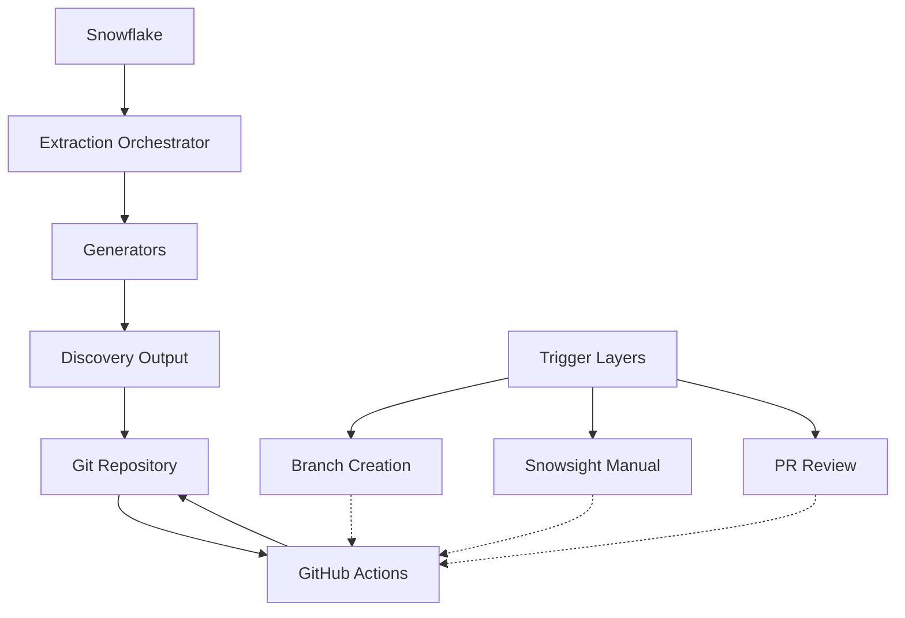

# Architecture Documentation

## Architecture Decision Records (ADRs)

### ADR-001: Key-Pair Authentication
**Status:** Accepted
**Date:** 2026-03-23
**Context:** Need secure Snowflake authentication for automated workflows
**Decision:** Use RSA key-pair authentication instead of OIDC
**Consequences:** Private keys stored in GitHub Secrets, rotated independently

### ADR-002: Hybrid Output Format
**Status:** Accepted
**Date:** 2026-03-23
**Context:** Need both human-readable DDLs and machine-readable metadata
**Decision:** Generate both .sql files (with comments) and .json files (with rich metadata)
**Consequences:** Cross-referenced files enable both human review and programmatic access

### ADR-003: Three-Layer Trigger Architecture
**Status:** Accepted
**Date:** 2026-03-23
**Context:** Need automated discovery with manual control and review gates
**Decision:** Implement three-layer trigger architecture:
  1. Branch creation → auto-discovery commit
  2. Snowsight manual → diff check → PR to main
  3. Main always requires PR (no direct commits)
**Consequences:** Ensures all changes are reviewed before reaching main

## Data Flow Diagram

## Design Tree Decisions

**Python Connector vs Snowpark:**
- Chose: Python Connector (snowflake-connector-python)
- Reason: User requested, simpler deployment, no JVM dependency
- Trade-off: Less Snowpark-specific features

**YAML Configuration vs CLI Args:**
- Chose: YAML configuration file
- Reason: More flexible, supports multiple targets, versioning
- Trade-off: Requires file management

**Error Handling Strategy:**
- Chose: Retry-then-skip with error logging
- Reason: Partial failures shouldn't block entire extraction
- Trade-off: Users must review error logs

**Testing Strategy:**
- Chose: TDD with pytest and mocking
- Reason: Fast feedback, no Snowflake dependency for unit tests
- Trade-off: Integration tests require mocks

### Technology Stack
- Snowflake Connector: snowflake-connector-python
- Config: Pydantic v2
- YAML: PyYAML
- HTTP: requests (via Snowflake Python runtime)
- Testing: pytest, pytest-cov
- Version Control: Git
- CI/CD: GitHub Actions
